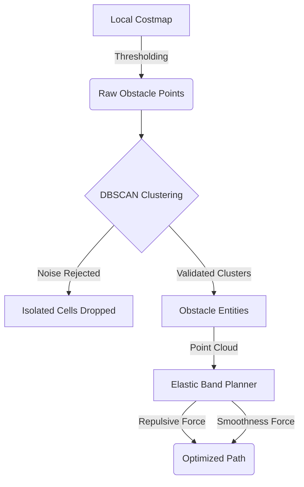

# Elastic Band Planner with DBSCAN Noise Filtering

This document explains the integration of **DBSCAN (Density-Based Spatial Clustering of Applications with Noise)** and the **Elastic Band (EB)** local planner. It details how raw sensor data is transformed into a smooth, obstacle-avoiding trajectory by leveraging clustering for noise rejection.

---

## 1. System Architecture

The local planning pipeline consists of three main stages:
1.  **Costmap Extraction:** Identifying occupied cells from the local costmap.
2.  **DBSCAN Clustering:** Grouping cells into obstacle entities and filtering out sensor noise.
3.  **Elastic Band Optimization:** Iteratively refining the path using repulsive and attractive forces.



---

## 2. DBSCAN: Identifying "Real" Obstacles

DBSCAN is used to ensure that only dense groups of occupied cells (likely real objects) affect the robot's path.

### Key Parameters
-   $\epsilon$ (eps): The neighborhood radius. Two points are neighbors if their distance $\le \epsilon$.
-   $min\_samples$: The minimum number of neighbors required to form a "core" point.

### Logic
1.  **Core Points:** A point is a *core point* if it has at least $min\_samples$ in its $\epsilon$-neighborhood.
2.  **Cluster Expansion:** Clusters grow from core points to include all reachable neighbors.
3.  **Noise Rejection:** Points that are neither core points nor reachable from core points are labeled as **Noise** and discarded.

**Why use DBSCAN here?**
Isolated cells caused by sensor flicker or dust would otherwise create "ghost" obstacles, causing the Elastic Band to "jitter" or deviate unnecessarily. DBSCAN acts as a spatial filter that validates obstacles based on density.

---

## 3. Elastic Band Force Calculation

The planner treats the path as a series of waypoints $\mathbf{w}_i = (x_i, y_i)$ connected by virtual springs. In each cycle, it performs gradient descent to minimize a cost function composed of obstacle and smoothness terms.

### 3.1 Repulsive Force (from Grouped Points)
For each waypoint $\mathbf{w}_i$, the planner finds the **nearest validated obstacle point** $\mathbf{p}_{best}$ from the clusters identified by DBSCAN.

$$d = \|\mathbf{w}_i - \mathbf{p}_{best}\| = \sqrt{(x_i - p_x)^2 + (y_i - p_y)^2}$$

If the distance $d$ is less than the **inflation radius** $d_{inf}$, a repulsive force is applied:

$$\mathbf{F}_{obs} = w_{obs} \cdot (d_{inf} - d) \cdot \frac{\mathbf{w}_i - \mathbf{p}_{best}}{d}$$

Where:
-   $w_{obs}$ is the obstacle weight.
-   The term $(d_{inf} - d)$ ensures the force increases as the robot gets closer to the obstacle.
-   The term $\frac{\mathbf{w}_i - \mathbf{p}_{best}}{d}$ is the unit vector pointing away from the obstacle.

### 3.2 Smoothness Force (Elasticity)
To keep the path smooth and prevent it from stretching infinitely, each waypoint is pulled toward the midpoint of its neighbors:

$$\mathbf{F}_{smooth} = w_{smooth} \cdot \left( \frac{\mathbf{w}_{i-1} + \mathbf{w}_{i+1}}{2} - \mathbf{w}_i \right)$$

This acts as a "internal tension" that straightens the band.

---

## 4. "Group" Force Dynamics

In this implementation, the "group" (cluster) influences the planner in two distinct ways:

### 4.1 Validation via Clustering (Current Implementation)
DBSCAN groups raw costmap cells into clusters. The planner then uses all points belonging to these clusters as potential sources of repulsion. 
- **Effect:** A waypoint is pushed by the *closest member* of the nearest group.
- **Benefit:** This provides high-fidelity avoidance for complex shapes (e.g., long walls or L-shaped obstacles) while still benefiting from the noise rejection of a group-based filter.

### 4.2 Potential Centroid-based Force (Future/Alternative)
DBSCAN also provides a `centroid` and `radius` for each cluster. For certain social navigation tasks, one might calculate a force from the group's center:

$$\mathbf{F}_{group} = w_{group} \cdot \max(0, (R_{cluster} + d_{inf}) - \|\mathbf{w}_i - \mathbf{C}_{cluster}\|) \cdot \frac{\mathbf{w}_i - \mathbf{C}_{cluster}}{\|\dots\|}$$

Where $\mathbf{C}_{cluster}$ is the centroid and $R_{cluster}$ is the cluster radius. This treats the entire group as a single circular obstacle.

---

## 5. Integration Summary

The "Force from Group" in this implementation is achieved by:
1.  **Validating** the existence of an obstacle via DBSCAN.
2.  **Accumulating** the repulsive effects of the constituent points of the group.
3.  **Clamping** the movement in each iteration to ensure stability.

### The Update Rule
In every iteration $k$, each interior waypoint is updated:

$$\mathbf{w}_i^{(k+1)} = \mathbf{w}_i^{(k)} + \text{clamp}\left( \Delta t \cdot (\mathbf{F}_{obs} + \mathbf{F}_{smooth}), \Delta_{max} \right)$$

This iterative process continues (e.g., 60 times per cycle) until the band reaches an equilibrium between the "push" of the obstacles and the "pull" of the reference path and smoothness constraints.

---

## 5. Visualization of Force Interactions

Below is a conceptual visualization of a waypoint $\mathbf{w}_i$ being pushed by a cluster (group) of points.

```mermaid
view-model
  %% Not standard mermaid, but conceptual representation
  Waypoint -- F_smooth --> Midpoint[Midpoint of Neighbors]
  Waypoint -- F_obs --> Obstacle_Point[Nearest Validated Point in Cluster]
  
  subgraph Cluster
    Obstacle_Point
    P1
    P2
    P3
  end
```

By only using points that are part of a `Cluster`, the robot ignores the single isolated point `P_noise` that would have otherwise pushed it off course.
