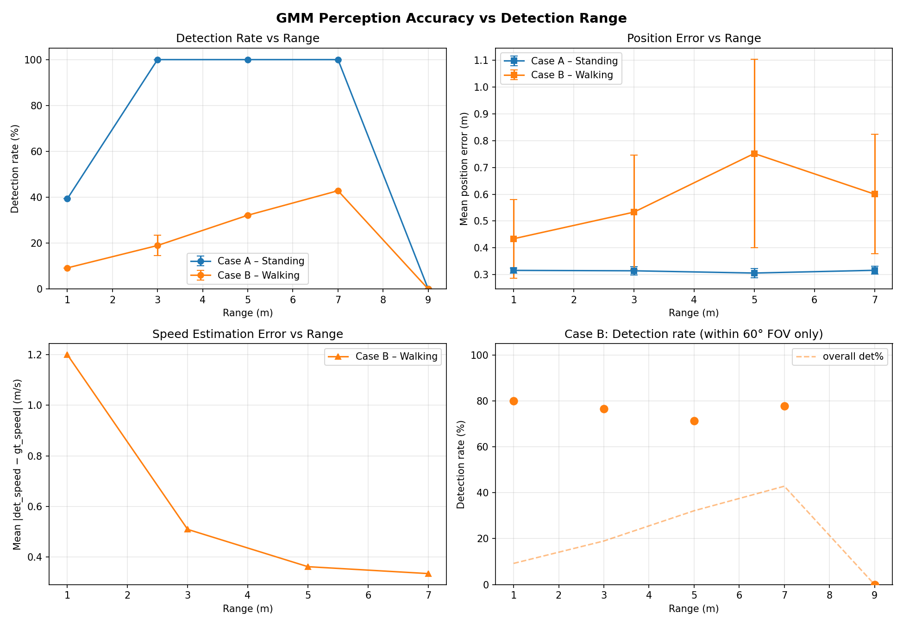
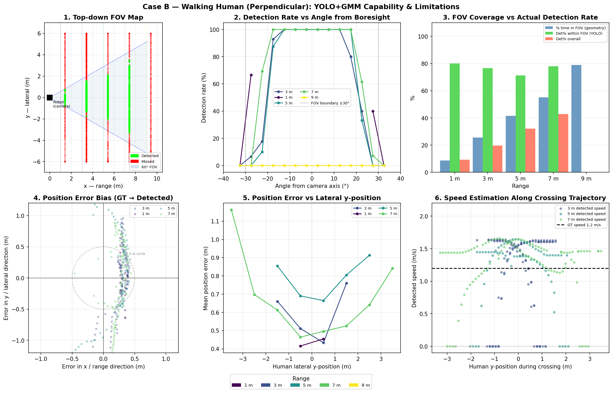
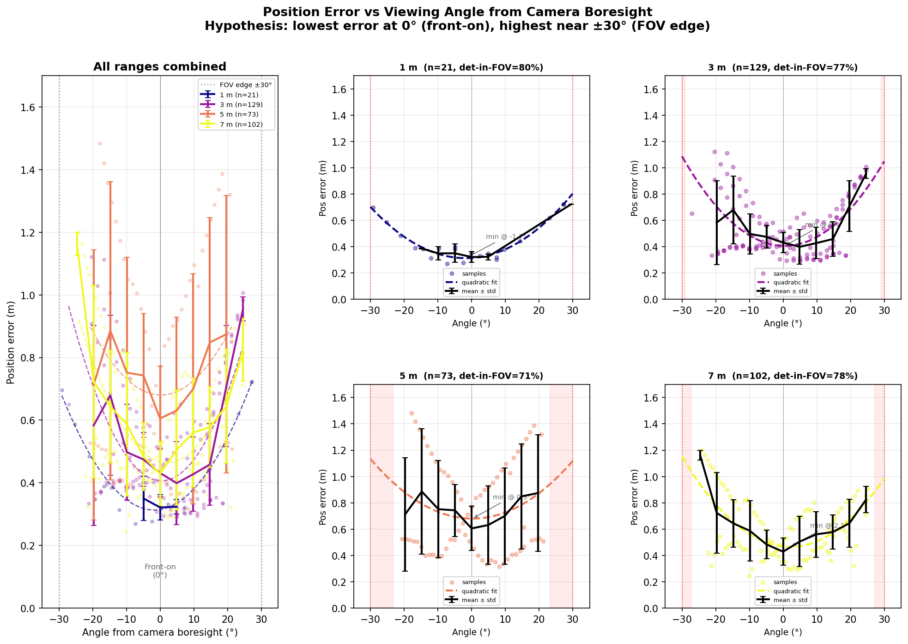

# Socially-Aware Mecanum Robot Navigation

**ROS 2 Humble + Ignition Gazebo Fortress** simulation platform for a mecanum-wheeled robot navigating dynamic human environments using a **TEB-style elastic-band local planner** with a **YOLO + LiDAR human-perception** stack and an **asymmetric Gaussian social costmap**.

This document is both a setup guide *and* a project report: the architecture, the algorithms that were implemented, the test worlds, and the measured perception performance are all here.

---

## 1. Project goals

Mobile robots that share space with people cannot treat humans like static obstacles — humans have intent, direction, and personal-space expectations. This project builds a complete simulation stack with the following components fully wired up end-to-end:

1. **Mecanum-wheel holonomic robot** with LiDAR, depth-camera-equivalent RGB, IMU, and ground-truth odometry from Gazebo.
2. **Camera+LiDAR human detection** — YOLOv8 bounding boxes are projected through the LiDAR scan to recover odom-frame `(x, y)` positions; a per-person tracker fits velocity from a 1.5-s sliding window.
3. **Asymmetric Gaussian social costmap** — each tracked human contributes a Gaussian whose front lobe scales with their forward velocity, producing an egg-shaped “personal space” that the planner naturally routes around.
4. **TEB elastic-band local planner** — costmap cells are clustered and decomposed by a Multi-Convex-Hull (MCCH) algorithm into polygon obstacles; an elastic band is then optimised against smoothness + obstacle-clearance terms and converted to holonomic `(vx, vy, ω)`.
5. **12 test worlds** spanning static obstacles, oncoming pedestrians, crowds, and dedicated perception-calibration scenes.

---

## 2. System architecture

The system can be driven by **either** of two mutually exclusive controller pipelines. The current branch focuses on the TEB stack — pure-pursuit remains complete and read-only as a reference baseline.

### 2.1 TEB-direct pipeline (active development)

```
                                ┌──────────────────────┐
   /scan ─────────────────────► │ local_costmap_node   │
                                │ (LiDAR → grid)       │
                                └────────┬─────────────┘
                                         │ /local_costmap
                                         ▼
   /front_camera/image_raw ┐     ┌──────────────────────┐
   /scan ──────────────────┼───► │ social_costmap_node  │ ──► /local_costmap_social
   /odom ──────────────────┘     │ (YOLO + Gaussians)   │     /detected_humans
                                 └──────────────────────┘
                                         │
   /goal_pose ──► global_path_node ──► /global_path
                                         │
                                         ▼
                                 ┌──────────────────────┐
                                 │ path_planning_node   │
                                 │ (TEB elastic band)   │
                                 └────────┬─────────────┘
                                          │ /cmd_vel  (TwistStamped)
                                          ▼
                                    cmd_vel_relay
                                          │ /cmd_vel_gz (Twist)
                                          ▼
                                    Ignition VelocityControl
```

Launched by [src/path_planning/launch/teb_human_detection.launch.py](src/path_planning/launch/teb_human_detection.launch.py) (full stack with social costmap) or [src/path_planning/launch/teb_direct.launch.py](src/path_planning/launch/teb_direct.launch.py) (TEB on pure LiDAR costmap, no perception).

### 2.2 Pure-pursuit pipeline (reference baseline)

`path_planning_node` *(stub mode)* → `/planned_path` → `pure_pursuit_node` (Regulated Pure Pursuit) → `/cmd_vel`. Launched by [src/mecanum_robot_sim/launch/spawn_mecanum.launch.py](src/mecanum_robot_sim/launch/spawn_mecanum.launch.py). Pure-pursuit is treated as **read-only**.

---

## 3. Implementation details

### 3.1 Human perception ([src/human_detection/](src/human_detection/))

**Detection** — YOLOv8-nano runs on the 640×480 front-camera image (camera publishes at 30 Hz; YOLO-on-CPU throughput is the bottleneck). For each `person` bounding box, the column-centre pixel is converted to a bearing through the pinhole model, the 360-sample LiDAR scan is queried in a ±8-sample (≈ ±8°) window around that bearing, and the **monocular bbox-height depth** acts as a prior that selects which LiDAR return belongs to the person (rather than picking up the back wall). The chosen range + bearing project to odom via the camera→base_link→odom transform.

> Two perception nodes ship in this package and share the same `PersonTracker` core:
> - **`social_costmap_node`** (launched by `teb_human_detection.launch.py`) — *subscribes* to the LiDAR `/local_costmap` and fuses its social overlay into `/local_costmap_social`. This is the active pipeline.
> - **`human_detection_node`** — alternative node that publishes a standalone Gaussian-only `/local_costmap` plus `/detected_human_poses` (PoseArray). Available as an entry point but **not launched by any of the shipped launch files**; kept as a reference for swapping perception backends.

**Tracking** — `PersonTracker` keeps a 1.5 s sliding window per ID and fits velocity by least-squares slope on the smoothed positions. Two design choices that matter:

- **EMA on raw position** (α = 0.5) before the velocity fit. The actor mesh has no collision body, so depth falls back to bbox-height monocular depth, which oscillates ~0.4 m at the ~2 Hz walking cadence. A sub-cycle window would alias that periodic noise into a phantom radial velocity — flipping the social-zone heading. EMA suppresses the high-frequency component while preserving the slope.
- **0.8 s coast on miss** — a track survives this long without a fresh detection, continuing on its fitted velocity. YOLO at conf = 0.5 routinely drops a person for a frame or two (motion blur, partial FOV). Without coasting the social zone would blink out and respawn with a new ID and zero velocity, the “jumps / disappears” failure mode.

**Social costmap** ([src/human_detection/human_detection/social_costmap_node.py](src/human_detection/human_detection/social_costmap_node.py)) — for every tracked human, an asymmetric Gaussian is rasterised into a copy of `/local_costmap` and published as `/local_costmap_social`. The forward σ grows linearly with the human’s speed (faster walker → longer egg) while side and rear σ stay fixed. The planner consumes this fused grid directly, so social cost and physical obstacles are optimised against the same objective.

### 3.2 TEB elastic-band local planner ([src/path_planning/](src/path_planning/))

The optimiser ([path_planning/elastic_band.py](src/path_planning/path_planning/elastic_band.py)) is dependency-free pure Python and can be unit-tested without ROS. The ROS plumbing lives in [path_planning_node.py](src/path_planning/path_planning/path_planning_node.py) and runs one cycle at 10 Hz:

1. **Costmap → polygons.** BFS-cluster all lethal cells in a window around the robot, then run **MCCH decomposition** on each cluster. A plain convex hull is a poor approximation for L/U/T-shaped obstacles — its diagonal edges cut across free space and trap the robot inside fake polygons at concave inner corners. MCCH detects “fictitious” edges (whose midpoint is far from any cluster cell) and recursively splits the cluster perpendicular to the worst edge until every sub-hull tracks the real occupancy. (This mirrors `nav2 costmap_converter::CostmapToPolygonsDBSMCCH`.)
2. **Local segment extraction.** Prune the global path behind the robot, take a configurable lookahead window (default 15 m).
3. **Elastic-band optimisation.** Gradient descent for 60 iterations against `w_smooth · ‖p_{i-1} − 2p_i + p_{i+1}‖²  +  w_obs · barrier(p_i, polys, inflation)`. Each node movement is clamped to `max_delta = 0.10 m` per iteration so the band cannot teleport through obstacles.
4. **Holonomic velocity extraction.** Vector pursuit on the deformed band gives a target body-frame `(vx, vy)`; a proportional yaw controller steers heading toward the direction of travel. The output is `/cmd_vel` (TwistStamped) directly — no separate path follower.

### 3.3 Simulation infrastructure ([src/mecanum_robot_sim/](src/mecanum_robot_sim/))

- **`gz_pose_odom.py`** — converts Gazebo ground-truth pose to `/odom` + `odom→base_link` TF.
- **`cmd_vel_relay.py`** — strips TwistStamped → Twist for the Ignition VelocityControl bridge **and negates `linear.y`** to compensate for an Ignition y-axis flip. Any mecanum-strafing sign fix belongs here; do not double-correct in pure_pursuit or path_planning.
- **`human_controller.py`** — drives each kinematic human along its SDF-embedded waypoints via the `SetEntityPose` service (replaces an earlier subprocess implementation that spammed `Host unreachable` from ign-transport).
- **`human_marker_publisher.py`** — analytic RViz markers for humans (Ignition actors don’t appear in `dynamic_pose/info`, so positions are computed from `/clock` + SDF waypoints).
- **`scale_human_speed.py`** — CLI utility to rewrite waypoint times so a chosen human (or all) walks at a target m/s. Animated `<actor>` and kinematic `<model>` share the same waypoint table, so a single edit keeps animation and ground-truth in sync.

### 3.4 Test worlds ([src/mecanum_robot_sim/worlds/](src/mecanum_robot_sim/worlds/))

| World | Purpose |
|---|---|
| `crossing_humans.sdf`, `crossing_humans_v2.sdf` | Default scene — two humans walking across the robot’s path |
| `world1_static_large.sdf` | Single large static obstacle — sanity check for the band |
| `world2_static_two.sdf` | Two static obstacles forming a corridor |
| `world3_cross_opposite.sdf` | Human crossing opposite to robot motion |
| `world4_cross_same.sdf` | Human crossing in the same direction as the robot |
| `world5_human_oncoming.sdf` | Head-on encounter |
| `world6_human_ahead.sdf` | Slow human directly ahead — passing manoeuvre |
| `world7_crowd_vertical.sdf` | Vertical column of pedestrians |
| `world8_humans_crossing.sdf` | Multi-human crossing scenario |
| `world_perc_stand.sdf` | Perception calibration — stationary target at marked distances |
| `world_perc_walk.sdf` | Perception calibration — walking target across the FOV |

---

## 4. Results

Detailed perception logs are recorded by `social_costmap_node` into CSV files under `~/robot_logs/`. The scripts in [analysis/](analysis/) post-process those logs and produce the figures below.

### 4.1 Perception summary — [analysis/perception_summary.png](analysis/perception_summary.png)



Aggregate detection rate, position error, and speed error across all `world_perc_stand` and `world_perc_walk` runs, binned by ground-truth range (1, 3, 5, 7 m). Detection rate degrades at the FOV edges and beyond 5 m; speed estimates require the GMM-style track window to fill before they stabilise (warm-up tail visible at the start of each crossing).

### 4.2 Walking-human deep-dive — [analysis/walk_analysis.png](analysis/walk_analysis.png)



Six-panel analysis of Case B (perpendicular walking human): bird-eye hit/miss map, detection rate vs. boresight angle, expected-in-FOV vs. detected, bias vectors of estimated position relative to ground truth, position-error vs. lateral y, and speed estimation along the crossing. The bias vectors reveal a systematic forward-bias at far range from the bbox-height monocular depth fallback.

### 4.3 FOV-angle sensitivity — [analysis/angle_error.png](analysis/angle_error.png)



Position error as a function of angle from the camera boresight, binned by range. Error is lowest at 0° and rises toward the ±30° edges of the FOV — consistent with monocular depth degradation off-axis and LiDAR-bearing quantisation.

---

## 5. Installation

| Requirement | Version |
|---|---|
| Ubuntu | 22.04 LTS |
| ROS 2 | Humble Hawksbill |
| Gazebo | Ignition Fortress (`gz-sim 6`) |
| Python | 3.10+ |

```bash
# 1. Clone
git clone <your-repo-url> ~/mobile_project_new
cd ~/mobile_project_new

# 2. ROS 2 / Gazebo dependencies
sudo apt update && sudo apt install -y \
  ros-humble-ros-gz-sim ros-humble-ros-gz-bridge ros-humble-ros-gz-image \
  ros-humble-ros-gz-interfaces \
  ros-humble-robot-state-publisher ros-humble-joint-state-publisher \
  ros-humble-xacro ros-humble-rviz2 ros-humble-tf2-ros \
  ros-humble-nav-msgs ros-humble-sensor-msgs ros-humble-visualization-msgs

# 3. Python dependencies
pip install ultralytics opencv-python numpy

# 4. Actor mesh for walking humans (one-time)
ign fuel download -u https://fuel.gazebosim.org/1.0/mingfei/models/actor

# 5. Build
source /opt/ros/humble/setup.bash
colcon build
source install/setup.bash

# 6. (Optional) Add the workspace to .bashrc
echo "source ~/mobile_project_new/install/setup.bash" >> ~/.bashrc
```

`yolov8n.pt` ships in the repo root. Both perception nodes load it with `YOLO('yolov8n.pt')`, which resolves to the current working directory — launch them from the workspace root, or the file will silently re-download on first use.

---

## 6. Running

### 6.1 Full stack: TEB + social costmap

```bash
ros2 launch path_planning teb_human_detection.launch.py \
    world:=crossing_humans goal_x:=7.0 goal_y:=0.0
```

Opens Gazebo + RViz, spawns the robot at world (-7, 0) → odom (0, 0), publishes a goal 5 s after start. Add `auto_goal:=false` to send goals manually from RViz’s 2D Nav Goal tool.

### 6.2 TEB without perception (pure LiDAR)

```bash
ros2 launch path_planning teb_direct.launch.py world:=world1_static_large
```

### 6.3 Pure-pursuit reference pipeline

```bash
ros2 launch mecanum_robot_sim spawn_mecanum.launch.py
```

### 6.4 Sending a goal from the CLI

```bash
ros2 topic pub --once /goal_pose geometry_msgs/msg/PoseStamped \
  "{header: {frame_id: 'odom'}, pose: {position: {x: 5.0, y: 3.0}, orientation: {w: 1.0}}}"
```

### 6.5 Common launch arguments

| Argument | Default | Notes |
|---|---|---|
| `world` | `crossing_humans` (TEB launches), `crossing_humans_v2` (spawn_mecanum) | World SDF stem under `src/mecanum_robot_sim/worlds/` |
| `spawn_x`, `spawn_y` | `-7.0`, `0.0` | Robot start in world frame |
| `goal_x`, `goal_y` | `7.0`, `0.0` | Auto-goal target in odom frame |
| `auto_goal` | `true` | Auto-publish goal after 5 s |
| `rviz` | `true` | Open RViz with the project config |
| `lookahead_dist` | `15.0` | TEB local-segment window (m) |
| `time_scale` | `1.0` | Multiplier on human walking speed |

### 6.6 Re-tuning a human’s walking speed

```bash
ros2 run mecanum_robot_sim scale_human_speed --show --world ALL
ros2 run mecanum_robot_sim scale_human_speed --world crossing_humans \
    --human human_1 --target-mps 0.8
```

### 6.7 Regenerating the figures in §4

```bash
# CSVs are recorded by social_costmap_node into ~/robot_logs/.
# Once you have logs, run any of:
python3 analysis/analyze_perception.py
python3 analysis/analyze_walk.py
python3 analysis/analyze_angle_error.py
```

---

## 7. Topic interface

| Topic | Type | Direction |
|---|---|---|
| `/scan` | `sensor_msgs/LaserScan` | gz bridge → human_detection / local_costmap |
| `/front_camera/image_raw` | `sensor_msgs/Image` | gz bridge → human_detection |
| `/odom` | `nav_msgs/Odometry` | gz_pose_odom → planners |
| `/goal_pose` | `geometry_msgs/PoseStamped` | RViz / CLI → global_path_node |
| `/global_path` | `nav_msgs/Path` | global_path_node → path_planning |
| `/local_costmap` | `nav_msgs/OccupancyGrid` | local_costmap_node → social_costmap_node |
| `/local_costmap_social` | `nav_msgs/OccupancyGrid` | social_costmap_node → path_planning |
| `/detected_humans` | `visualization_msgs/MarkerArray` | social_costmap_node → RViz |
| `/detected_human_poses` | `geometry_msgs/PoseArray` | human_detection_node (alternative perception, not in default launch) |
| `/planned_path` | `nav_msgs/Path` | path_planning → RViz |
| `/obstacle_polygons` | `visualization_msgs/MarkerArray` | path_planning → RViz |
| `/cmd_vel` | `geometry_msgs/TwistStamped` | path_planning → cmd_vel_relay |
| `/cmd_vel_gz` | `geometry_msgs/Twist` | cmd_vel_relay → Ignition VelocityControl |

---

## 8. Repository layout

```
mobile_project_new/
├── README.md                       This file
├── run.md                          Quick-reference launch commands
├── CLAUDE.md                       Project context for AI-assisted development
├── yolov8n.pt                      YOLOv8-nano weights (loaded by perception nodes)
├── gmm_social_navigation.py        Standalone Matplotlib study for the
│                                   social-cost Gaussian formulation
├── analysis/                       Off-line post-processing of perception logs
│   ├── analyze_perception.py
│   ├── analyze_walk.py
│   ├── analyze_angle_error.py
│   └── *.png                       Figures referenced in §4
└── src/
    ├── mecanum_robot_sim/          Simulation infrastructure
    │   ├── urdf/                   Robot + sensors + VelocityControl plugin
    │   ├── worlds/                 12 test worlds (see §3.4)
    │   ├── config/                 RViz layouts
    │   ├── launch/spawn_mecanum.launch.py
    │   └── scripts/                gz_pose_odom, cmd_vel_relay,
    │                               human_controller, human_marker_publisher,
    │                               scale_human_speed
    │
    ├── human_detection/            Perception package
    │   └── human_detection/
    │       ├── human_detection_node.py   YOLO + LiDAR detector
    │       └── social_costmap_node.py    Gaussian overlay → /local_costmap_social
    │
    ├── path_planning/              Planning package
    │   ├── launch/                 teb_direct, teb_human_detection,
    │   │                           costmap_sim
    │   └── path_planning/
    │       ├── local_costmap_node.py     LiDAR → OccupancyGrid
    │       ├── global_path_node.py       Straight-line reference path
    │       ├── elastic_band.py           Pure-Python TEB optimiser
    │       └── path_planning_node.py     ROS plumbing + MCCH + velocity ext.
    │
    └── pure_pursuit/               Reference RPP controller (read-only)
```

---

## 9. Developer guide

### 9.1 Extending the elastic-band planner

The optimiser is decoupled from ROS — see [src/path_planning/path_planning/elastic_band.py](src/path_planning/path_planning/elastic_band.py). Tunables live in `ElasticBandConfig`:

| Field | Default | Effect |
|---|---|---|
| `n_iter` | 60 | Gradient-descent iterations per cycle |
| `w_obs` | 50.0 | Obstacle barrier weight |
| `w_smooth` | 2.0 | Smoothness weight (second-difference) |
| `inflation` | 1.0 | Barrier radius (m) around each polygon edge |
| `step` | 0.05 | Gradient step size |
| `max_delta` | 0.10 | Per-iteration clamp on node movement (m) |
| `skip_dist` | 0.4 | Drop band nodes closer than this (re-uniformise) |

Polygon decomposition is controlled by `mcch_split_thresh` (default 0.3 m) in [path_planning_node.py](src/path_planning/path_planning/path_planning_node.py). Smaller values give finer splits at the cost of more polygons per cycle.

### 9.2 Modifying the social cost

`social_costmap_node` exposes `peak_cost`, `sigma_back`, `sigma_side`, `min_front_scale`, and `velocity_factor` as instance attributes. The forward σ is `min_front_scale + velocity · velocity_factor`, so a faster walker projects a longer egg into their direction of travel.

### 9.3 Adding a new test world

1. Drop the SDF into [src/mecanum_robot_sim/worlds/](src/mecanum_robot_sim/worlds/).
2. Reference any kinematic humans by giving them a `<plugin filename="__waypoints__">` block whose schema matches the existing worlds (delay, loop, waypoints).
3. `human_controller` and `human_marker_publisher` discover humans by parsing the active world SDF — no code changes needed.
4. Launch with `world:=<your_world_stem>`.

### 9.4 Working with the pure-pursuit baseline

Pure-pursuit ([src/pure_pursuit/](src/pure_pursuit/)) implements Regulated Pure Pursuit (RPP) and is treated as **read-only**. It consumes `/planned_path` + `/odom` + `/real_map` and emits `/cmd_vel`. If you need it for comparison runs, launch [spawn_mecanum.launch.py](src/mecanum_robot_sim/launch/spawn_mecanum.launch.py) which wires it in instead of the TEB path_planning_node.

---

## 10. Troubleshooting

**Sensor topics are silent**
> The `<plugin filename="libignition-gazebo-sensors-system.so">` block must be present in the world SDF, and the world must use the `ogre2` render engine.

**Humans don’t appear in RViz**
> Ignition actors are not in `dynamic_pose/info`. Marker positions are computed analytically by `human_marker_publisher` from `/clock` + SDF waypoints — make sure it’s running and that `/clock` is being bridged.

**Robot strafes the wrong direction**
> Already handled by `cmd_vel_relay.py` (negates `linear.y` to fix VelocityControl’s y-axis flip). Do not add a second negation in any downstream node.

**YOLO weights re-downloading on every launch**
> Launch from the workspace root so `YOLO('yolov8n.pt')` resolves to the shipped file. Or pass an absolute path in `human_detection_node.py:215` / `social_costmap_node.py:255`.

**Clean rebuild**
```bash
rm -rf build install log && colcon build && source install/setup.bash
```

---

## 11. License

Apache 2.0.

- Mecanum URDF adapted from [gz_ros2_control](https://github.com/ros-controls/gz_ros2_control) (Apache 2.0).
- Walking actor mesh: [mingfei/actor](https://app.gazebosim.org/mingfei/fuels/models/actor) on Ignition Fuel.
- YOLOv8 weights: [Ultralytics](https://github.com/ultralytics/ultralytics) (AGPL-3.0 — see their license; weights file is included for convenience of offline use).
