# **Elastic Band Planner with Object Detection**

### Team Members and Roles

| Name | Roles |
|-------------|---------|
| Pavaris Asawakijtananont | Planner, evaluation |
| Anuwit Intet | Object Detection |
| Bhumipat Ngamphueak | Experiment setup, evaluation |

### Table of Contents
1. [Introduction](#1-introduction)
2. [Project Scope](#2-project-scope)
   - [Methodology](#methodology)
   - [GMM With Elastic Band](#gmm-with-elastic-band)
3. [Elastic Band Planner](#3-elastic-band-planner)
   - [Multiple Convex Hull for Object Representation (MCCH)](#multiple-convex-hull-for-object-representation-mcch)
   - [Pre Routing](#pre-routing)
4. [Human Detection](#4-human-detection)
   - [Per-Person Velocity & Orientation Estimation](#per-person-velocity--orientation-estimation)
   - [Asymmetric 2D Gaussian Model](#asymmetric-2d-gaussian-model)
6. [Experiment Design](#6-experiment-design)
   - [Perception](#perception)
   - [Planner and Integration](#planner-and-integration)
7. [Results](#7-results)
   - [Perception](#perception-1)
   - [Planner & System Integration](#planner--system-integration)
     - [Static Obstacle (Planner Only)](#static-obstacle-planner-only)
     - [Dynamic Obstacle (Planner Only)](#dynamic-obstacle-planner-only)
     - [Dynamic Obstacle (Integrated System)](#dynamic-obstacle-integrated-system)
8. [Discussion](#8-discussion)
  
## 1. Introduction

In real environments, a mobile robot constantly faces uncertainty from both its control system and its surroundings, which can deform the originally planned path into an inefficient (or unsafe) one. This problem becomes more severe in social settings, where moving people are themselves a source of uncertainty. Traditional local planners treat every obstacle as a static occupied cell — they do not exploit higher-level social information such as a pedestrian's position, heading, or velocity. As a consequence, the robot tends to react to a human only at the moment of collision rather than anticipating where the human will be a few seconds later.

This project addresses that gap by combining a **Elastic Band local planner** with a perception module that detects pedestrians, estimates their velocity, and projects an **asymmetric Gaussian "social zone"** in front of each person. The social zones are fused into the same local costmap that the planner already uses for static obstacles, so the elastic band naturally deforms around both the person and the space they are about to occupy.

<div align="center">
  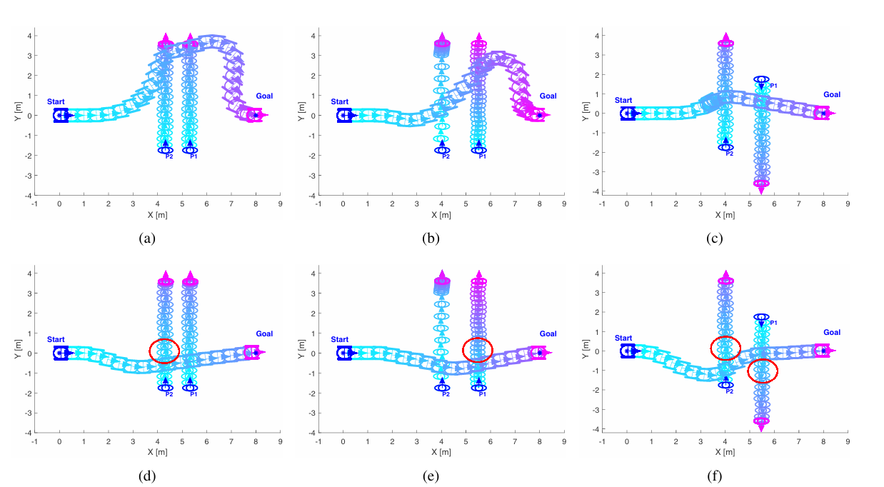
  <p><em>Reference result from the CPTEB paper. The top row shows trajectories produced by the baseline TEB planner; the bottom row shows the Collision-Prediction TEB (CPTEB). The robot is the blue circle with two wheels and the two pedestrians (P1, P2) are the cyan/magenta circles. Red circles mark collision zones, and blue arrows indicate the heading of the robot and each person.</em></p>
</div>

*Reference: The Collision Prediction Time Elastic Band (CPTEB) model.*


## 2. Project Scope
The goal of this project is to extend a traditional Elastic Band local planner so that it can use camera-based perception of pedestrians as additional planning information. The scope is:

1. Implement an Elastic Band local planner from scratch.
2. Detect humans and estimate their velocity with YOLOv8 + LiDAR depth refinement.
3. Use the estimated velocity to project an asymmetric (egg-shaped) Gaussian social cost so the planner can react to **where the human is going**, not only where the human currently is.
4. The platform is a **holonomic mecanum robot** (3-DoF base: `vx`, `vy`, `ωz`).

### Methodology

Perception and planning communicate through **one shared local costmap**: every detected human is written as elevated cost into the same grid that already holds the LiDAR obstacles. From the planner's point of view a moving person is just another (soft, oriented) obstacle, so the EB code does not need a separate "human list".

<!-- ```
LiDAR  ─► local_costmap_node ──► /local_costmap ─┐
                                                 ▼
Camera ─┐                                       social_costmap_node ──► /local_costmap_social
LiDAR  ─┼─► YOLO + tracker  ──► Gaussian per human ▲
Odom   ─┘                                          │
                                                 (fused)
                                                   │
Global path ─► path_planning_node (MCCH + EB optimiser) ──► /cmd_vel
``` -->

<tr>
  <td align="center">
    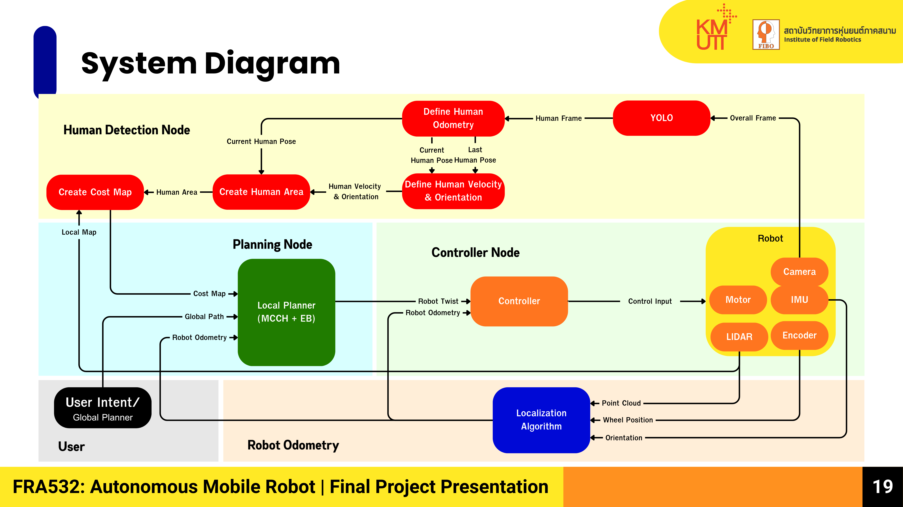
    <p>System Architecture of Elastic Band Planner with Perception module.</p>
  </td>
</tr>

### GMM With Elastic Band

The EB planner has no concept of "human" — it only knows polygons. The integration therefore happens entirely inside the costmap:

1. For each tracked person, `social_costmap_node` paints the asymmetric Gaussian (forward lobe length ∝ `|v|`, heading = `atan2(v_y, v_x)`) into the same grid that already carries the LiDAR walls, using `max(existing, gaussian)` so static obstacles are never erased.
2. `path_planning_node` BFS-clusters every cell above the lethal threshold and runs MCCH on each cluster. The Gaussian's elevated cells become **one or two convex polygons that point along the human's velocity**.
3. From there the EB optimiser treats those polygons exactly like any other obstacle — the repulsion force `F^{obs}` (see Section 3) deforms the band around the human's *future* position, not just their current one.

<!-- Because the social channel is just an alternate cost layer, switching it on or off is a launch-file parameter (`cost_map_topic: /local_costmap` vs. `/local_costmap_social`) — this is how we separate the *planner-only* and *integrated* experiments later. -->

## 3. Elastic Band Planner

The band is a chain of waypoints `x_i` connected by virtual springs. Each interior node is updated by gradient descent under two forces:

$$
\Delta x_i = \eta \bigl(\,w_{\text{obs}} F^{\text{obs}}_i + w_{\text{smooth}} F^{\text{smooth}}_i \bigr)
$$

- **Smoothness / contraction** — pulls each node toward the midpoint of its neighbours:

$$
F^{\text{smooth}}_i = \tfrac{1}{2}\bigl(x_{i-1}+x_{i+1}\bigr) - x_i
$$

- **Obstacle repulsion** — non-zero only inside an inflation radius `d_inf`, pointing away from the nearest polygon boundary point $`p^*`$:

$$
F^{\text{obs}}_i =
\begin{cases}
\bigl(d_{\text{inf}} - d_i\bigr) \dfrac{x_i - p^*}{\lVert x_i - p^*} & \text{if } 0 < d_i < d_{\text{inf}} \\[4pt]
0 & \text{if } d_i \ge d_{\text{inf}}
\end{cases}
$$


<div align="center">
  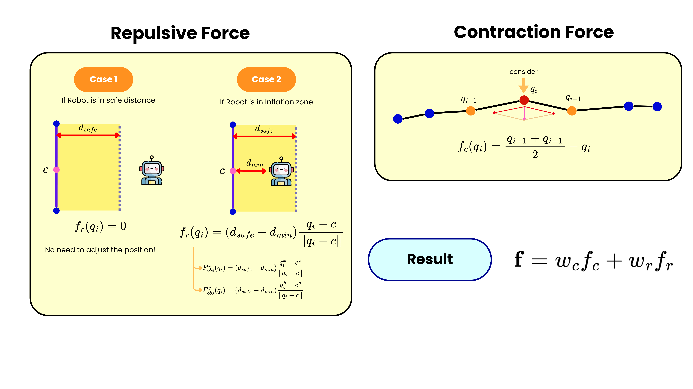
  <p><em>Elastic Band Force.</em></p>
</div>


Endpoints are fixed and `|Δx_i|` is clamped to `max_delta = 0.10 m/iter` so the band cannot teleport across narrow gaps. The band is anchored at the **actual robot pose** (not the closest global-path waypoint), otherwise the smoothness force would constantly drag the first node back into the obstacle whenever the robot deviates laterally.

<!-- Code: [`elastic_band.py`](src/path_planning/path_planning/elastic_band.py) (optimiser) and [`path_planning_node.py`](src/path_planning/path_planning/path_planning_node.py) (ROS plumbing). -->

### Multiple Convex Hull for Object Representation (MCCH)

To make obstacle distance cheap, occupied costmap cells are clustered (BFS, 8-connected) and each cluster is approximated by **convex polygons**. A single hull fails for concave clusters (L, U, T) because its diagonal edge swallows free space and the robot gets pinned inside a fake polygon. MCCH detects and fixes this by recursive splitting:

1. Compute the cluster's convex hull.
2. For each edge, let `e_mid` be its midpoint and measure `d = min_p ‖e_mid − p‖` over cluster points. Real edges → small `d`; fictitious edges → large `d`.
3. If `max(d) > split_threshold` (0.3 m), split the cluster along that edge direction at its midpoint and recurse on the two halves. Splitting along (not perpendicular to) the edge is robust: for an L-shape the two arms project onto opposite halves of the diagonal.
4. Stop when no edge exceeds the threshold.

Result: a small set of convex hulls that follows the real occupied geometry, so the repulsion force sees true free space.

### Pre Routing

Gradient descent cannot escape a polygon that fully contains a band node — the obstacle forces on the two sides cancel and the band stays pinned (symmetric force lock-in). nav2's TEB sidesteps this by exploring multiple homotopy classes; we instead deterministically push trapped nodes to **whichever side has the shorter detour**:

1. For each polygon, find the contiguous run of band nodes inside it.
2. Build a local "band direction" `b̂` from the nodes just before and after that run.
3. Project the polygon vertices onto `b̂⊥` and measure how far the polygon extends to each side (`max_left`, `max_right`).
4. Pick the side with the smaller extent and shift all trapped nodes by `extent + d_inf + 0.1 m` along that perpendicular.


## 4. Human Detection

### Per-Person Velocity & Orientation Estimation

This process works by determining the motion vectors, orientation, and average speed of each individual human in the global frame without relying on skeleton landmarks from the camera.

**1. Tracking & Spatial-Temporal Delta Processing**

In every frame where the camera frames the object using YOLO and calculates the 3D global coordinates $(w_x, w_y)$ via distance from the LiDAR scan, the system searches the memory history in `self.human_history` using the detection index ($person\_id$) to find the spatial and temporal differences:

Spatial Displacement:

$$\Delta d = \sqrt{(w_x - w_{prev\_x})^2 + (w_y - w_{prev\_y})^2}$$

Temporal Displacement:

$$\Delta t = \frac{t_{now} - t_{prev}}{10^9} \quad \text{(units: seconds)}$$

**2. Outlier Rejection & EMA Low-pass Filtering**

Frame-by-frame calculated velocity signals ($v_{instant} = \Delta d / \Delta t$) often have high jitter due to centimeter-level noise from LiDAR. Therefore, the system uses a three-stage filtering mechanism:

Time Gate: Calculated only when $0.0 < \Delta t < 1.0$ seconds to prevent jumps in case of frame drops.

Hard Clipping: Limits the absolute maximum speed of a human to $2.0 \text{ m/s}$.

Exponential Moving Average (EMA): Filters low frequencies using historical data for smoothness, weighting the original velocity up to 80% ($\alpha = 0.8$).

$$v_{smooth} = (\alpha \cdot v_{prev\_smooth}) + ((1 - \alpha) \cdot v_{instant})$$

**3. Velocity Thresholding & Zero-Velocity Latch**

To prevent the Social Zone area from shaking when a human stands still (but the sensor coordinates fluctuate), the code uses the following rules:

If $v_{smooth} < 0.1 \text{ m/s}$, force $v_{smooth} = 0.0 \text{ m/s}$.

Movement Orientation ($Yaw$) is calculated using:

$$\theta = \text{atan2}(\Delta y, \Delta x)$$

If the speed is detected to be below the threshold or the movement distance $\Delta d < 0.05 \text{ m}$, the system will immediately lock the value to use the same $Yaw$ angle from the previous frame. This prevents the shape rotating erratically when a person stands still.

### Asymmetric 2D Gaussian Model

Once the coordinates $(w_x, w_y)$, turning angle ($\theta$), and average speed ($v_{smooth}$) are obtained, the system calculates the shape as an egg, which is expanded more towards the front than towards the back and sides. Therefore, the system uses an asymmetric 2D Gaussian Distribution model in the human's local frame coordinates as follows:

$$f(r_x, r_y) = \exp \left( -\left( \frac{r_x^2}{2\sigma_x^2} + \frac{r_y^2}{2\sigma_y^2} \right) \right)$$

The asymmetry of this model is controlled by piecewise parameterization, which involves separating the standard deviation function ($\sigma_x$) in the movement axis ($x_{\text{local}}$) into two distinct sides based on the coordinate signs. To modify the slope to be uneven:

$$\sigma_x = \begin{cases} 
\sigma_{front} & \text{if } r_x > 0 \quad \text{(Area of the front hemisphere)} \\ 
\sigma_{back} & \text{if } r_x \le 0 \quad \text{(Area of the back hemisphere)} 
\end{cases}$$

Where $\sigma_y = \sigma_{side}$ is always constant for both the left and right sides ($\pm y_{\text{local}}$), the widest intersection point of the $y$ axis passes exactly through the center of the human body, without any centroid shift.

<!-- ## 5. Environment Setup -->


## 6. Experiment Design
The experiments are organised in three stages: first we validate the **perception module** in isolation, then the **planner module** in isolation, and finally the **integrated** system that uses perception to feed the planner.

### Environment setup

- **Platform.** Holonomic mecanum base with 3-DoF body twist `(v_x, v_y, ω_z)` — the chassis can strafe sideways without first turning to face the new direction.
- **Worlds.** Static cases use rectangular blocks placed in an Ignition / SDF world; dynamic cases use SDF-animated pedestrians whose motion is scripted by waypoints (see [Section 7 — Result numbers](#dynamic-obstacle-integrated-system) for the exact poses).
- **Human walking speed.** ~1.0 m/s in the perception sweep and **1.2 m/s** in the dynamic-obstacle worlds (derived from the SDF waypoint spacing 2.4 m / 2 s in [`world3_cross_opposite.sdf`](src/) and [`world4_cross_same.sdf`](src/)).
- **Goal tolerance.** 0.4 m radius around the goal pose.
- **Lookahead sweep.** `{2, 5, 10, 15} m` for the static slalom; `{2, 5, 10} m` for the dynamic worlds.

### Robot motion controller

The planner is not a single "go to goal" block — it is a stack with **two velocity layers** that together turn the optimised elastic band into a `TwistStamped` on `/cmd_vel`. Both layers run at 10 Hz inside [`path_planning_node.py`](src/). Knowing these parameters matters for the experiments because *the controller, not the planner, is what decides whether the robot can stop in time for a freshly-detected human*.

| Layer | Parameter | Value | What it does |
|---|---|---|---|
| Linear | `v_max` | **1.5 m/s** | Hard cap on `√(vₓ² + vᵧ²)`. Cruise speed for the whole run. |
| Linear | `cmd_lookahead` | 0.5 m | Distance ahead along the elastic band used to pick the velocity-direction vector. Short → the robot tracks the band tightly. |
| Linear | goal-approach ramp | `v_target = min(v_max, max(0.05, d_goal))` | Linear 1 : 1 deceleration in the **last 1.5 m**. Outside that window the robot is at `v_max`; below 1.5 m the speed shrinks with distance to a floor of 0.05 m/s. |
| Yaw | `ω_max` | **1.2 rad/s** | Hard cap on `|ω_z|`. |
| Yaw | `yaw_kp` | 1.5 | Proportional gain on the heading error. |
| Yaw | reference yaw | `goal_yaw = atan2(g_y − r_y, g_x − r_x)` | The controller continuously rotates the chassis to face the **goal pose** — *not* the current band-tangent. Because the base is holonomic, this is decoupled from the lateral strafe (vᵧ ≠ 0 is fine). |
| Safety | `sensor_timeout` | 0.5 s | If odom or costmap is older than this the controller publishes a zero-twist (`_pub_stop`). |

**Reading the table.** Two things are worth being explicit about, because the videos can be misleading:

1. **Yes, the robot cruises at v_max for most of every run.** The deceleration ramp only kicks in inside the final 1.5 m of straight-line distance to the goal (`d_goal < v_max ⇒ v_target = d_goal`). For a 15 m corridor that is the last ~10 % of the trajectory; everywhere else `v_target = 1.5 m/s` and the elastic band's only role in setting speed is choosing the *direction* `(xl/L, yl/L)`. There is **no obstacle-proximity slow-down** in this stack — the band assumes safe distance is maintained by the inflation radius alone.
2. **The yaw is *not* fixed.** The controller is `ω_z = clip(yaw_kp · wrap(goal_yaw − yaw), ±ω_max)`, i.e. proportional servo on the bearing from the robot to the **goal**. So during a sideways detour the chassis does keep rotating to face the goal, while the holonomic base provides the lateral motion through `linear.y`. This is why the recorded trajectories look like the robot is "sliding" around obstacles instead of pivoting — both `linear.y` and `angular.z` can be non-zero at the same time.

In effect the controller is *cruise at 1.5 m/s along the band direction, with the body always pointed at the goal, and a soft brake only in the last 1.5 m*. This is also the main reason a freshly-spawned egg can fail to stop a collision: at 1.5 m/s the robot covers the egg's 1.92 m forward lobe in ~1.3 s, which is shorter than the YOLO-on-CPU + tracker pipeline's worst-case dropout (0.8 s coast + ~0.3 s detection latency ≈ 1.1 s) — see [Section 7 result analysis](#dynamic-obstacle-integrated-system).

### Perception

**Goal of this experiment.**
The perception module feeds the planner *one* signal: an asymmetric Gaussian ("egg") painted onto the local costmap at the estimated position of each human, oriented along the estimated velocity. Before we can trust that signal to deform the elastic band, we have to characterise it on its own. Two questions drive the design:

1. **Availability** — at a given range and motion, what fraction of cycles produces *any* detection? An undetected human leaves the planner blind.
2. **Accuracy** — when a detection exists, how far is it from the true human pose? An egg that sits 1 m off the human is worse than no egg, because the planner is now confident about the wrong cell.

To isolate these from the planner and from the robot's own motion, the **robot is stationary** throughout. A single human is spawned at a controlled range, swept over **{1, 3, 5, 7, 9} m**, and two motion conditions are tested at each range:

1. **Case A — Standing human in front of the robot.** The human stands still directly in front of the robot. This isolates the *position* pipeline (YOLO box → monocular height depth → LiDAR refinement → world projection) from any motion. We expect a stationary detected position and a near-zero fitted speed; any non-zero speed here is the static-noise floor that the social costmap will paint as a (small) directional egg even when no one is moving.
2. **Case B — Human walking laterally across the robot's FOV.** A simulated pedestrian walks at ~1.0 m/s perpendicular to the robot's heading at the chosen range. This stresses the *velocity* pipeline (OLS line fit over the trajectory buffer, latency compensation, ID stability) and reveals how often the human falls outside the 60° horizontal FOV during the run.

<div align="center">
  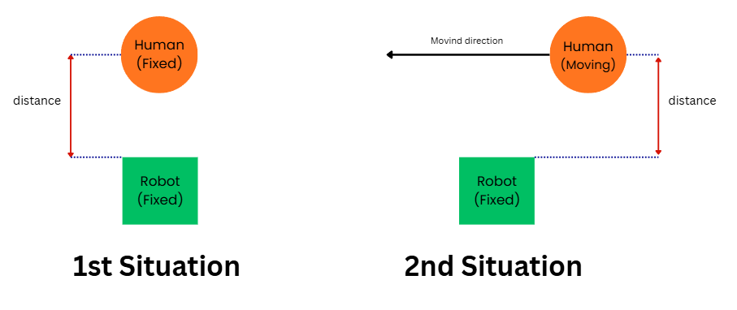
  <p><em>Perception test scenarios. <b>Left (1st situation):</b> the human stands at a fixed distance from the robot — used to measure position bias and the static-noise floor of the velocity estimator. <b>Right (2nd situation):</b> the human walks laterally past the stationary robot — used to measure the accuracy of the fitted speed and heading as a function of range.</em></p>
</div>

**Setup configuration.**
Both cases share the same sensing and tracking configuration, which is what gets shipped to the integrated system in Section 7:

| Group | Parameter | Value | Meaning |
|---|---|---|---|
| Camera | resolution | 640 × 480 px | Front RGB image fed to YOLOv8n |
| Camera | horizontal FOV | 60° (1.047 rad) | Half-cone ±30° from robot heading |
| Camera | mount offset | 0.40 m forward of `base_link` | Re-added in `_pixel_range_to_world` |
| Detector | model | YOLOv8n (`yolov8n.pt`) | CPU inference, class 0 (person) only |
| Detector | confidence threshold | 0.5 | Boxes below this are dropped |
| Detector | edge clip | 8 px | Boxes touching the image border are rejected (biased bearing) |
| Depth | LiDAR cluster window | ±8 samples (~17°) | Range window centred on the bearing |
| Depth | cluster depth | 0.5 m | Returns within this of the chosen one are the same surface |
| Depth | mono prior tolerance | `max(1.0 m, 0.30·d_mono)` | Grows with range to absorb monocular error |
| Depth | max detection range | 8.0 m | Hard cap above which detections are dropped |
| Tracker | history window | 1.5 s | Buffer used for the OLS velocity fit |
| Tracker | min fit points | 5 | Below this the track keeps `v = 0` |
| Tracker | min fit displacement | 0.20 m | First → last sample must travel this much |
| Tracker | min reported speed | 0.15 m/s | Below this `yaw` is frozen, egg stays oriented |
| Tracker | match radius | 1.5 m | World-frame distance for ID association |
| Tracker | coast timeout | 0.8 s | Track survives this long without a fresh detection |
| Tracker | EMA α (pos / vel) | 0.5 / 0.5 | Light smoothing on raw position and fitted velocity |
| Egg | σ<sub>min</sub> (front) | 1.2 m | Idle forward lobe of a stationary human |
| Egg | k<sub>v</sub> (velocity factor) | 0.6 s | Forward lobe grows by `k_v·\|v\|` |
| Egg | σ<sub>back</sub> | 0.4 m | Rear lobe (always short) |
| Egg | σ<sub>side</sub> | 0.5 m | Lateral half-width |
| Egg | C<sub>peak</sub> | 85 (cost) | Peak cost written into the costmap |

**Logging.**
While each run is active, `social_costmap_node` writes one row per detection cycle to `~/robot_logs/perception_log_<world>_<stamp>.csv` with `(time_s, gt_id, gt_x, gt_y, gt_speed_mps, det_id, det_x, det_y, pos_error_m, det_speed_mps, n_gt, n_detected)`. The ground-truth pose comes from the simulator's `/human_gt_poses` topic, and detection-to-GT pairing inside the logger uses ascending-distance greedy matching so the same person is not double-counted. Each `(case, range)` combination is run for ~20 s, and the longest run per range is kept for analysis. The CSVs are then post-processed by [`analyze_perception_viz.py`](src/) to produce the figures in Section 7.


### Planner and Integration
We use three scenarios to test the planner: a **Static Obstacle** world for the MCCH + pre-routing logic, and two **Dynamic Obstacle** worlds (humans walking from the same side, and humans walking from the opposite side) for the planner-only and integrated runs.

<div align="center">
  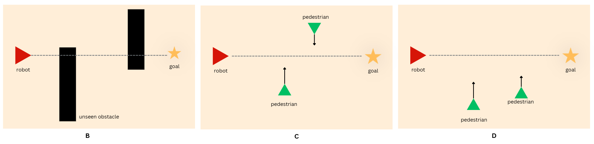
  <p><em>Planner test scenarios. <b>B — Static:</b> two rectangular blocks block the straight-line path between the robot (red triangle) and the goal (yellow star). <b>C — Dynamic, Opposite:</b> two pedestrians cross the corridor walking toward each other (one downward, one upward) while the robot drives left → right. <b>D — Dynamic, Same:</b> two pedestrians both walk upward, perpendicular to the robot's left → right direction of travel.</em></p>
</div>

1. **Static Obstacle (B)** — This scenario contains two static blocks that fully block the straight-line trajectory between the initial robot pose and the goal. It is used to stress the polygon-extraction + pre-routing pipeline and to measure how lookahead distance affects the detour length.

2. **Dynamic Obstacle, Same Direction (D)** — Two pedestrians walk **in the same direction** (both moving upward in the figure), perpendicular to the robot's path. They enter the corridor at slightly different `x` positions, so the robot has to weave through a moving "queue" rather than a single front. The forward Gaussian lobes of the two humans overlap, which can create a longer combined cost ridge that the band has to round.

3. **Dynamic Obstacle, Opposite Direction (C)** — Two pedestrians cross the corridor walking **toward each other** (one downward, one upward) while the robot drives left → right. This is the hardest case: the two humans intersect the robot's straight-line path at almost the same instant from opposite sides, and the egg of each one points across the corridor, so any avoidance manoeuvre by the robot has to commit early.

## 7. Results 
> [!NOTE]
> All result videos are stored in the `videos/` folder, organised by world (`world2/`, `world3/`, `world4/`).

### Perception

**Headline numbers.**
The two figures below summarise the entire perception sweep. Each subplot is one range; the green triangle / line is the simulator's ground truth, the red dots are the per-frame detected positions (latency-compensated to the current time, exactly as fed into the costmap), and the diamond in Case A is the mean detected position. The blue cone is the camera's 60° horizontal FOV. The numbers in the top-left of each subplot are the detection rate (fraction of cycles in which the human was matched to a track) and the mean position error in metres.

<div align="center">
  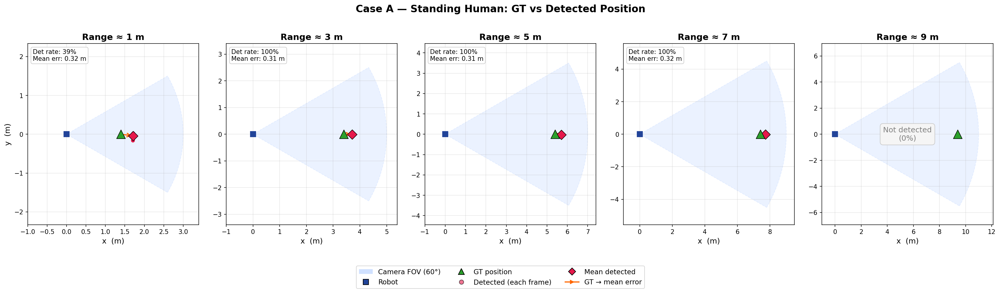
  <p><em><b>Figure P1 — Case A (standing human).</b> Per-range scatter of detected positions against the static GT. Det rate is the fraction of frames where a track was matched; mean err is the average GT → detection distance. The orange arrow goes from GT (green triangle) to the mean detection (red diamond) and visualises the systematic position bias.</em></p>
</div>

<div align="center">
  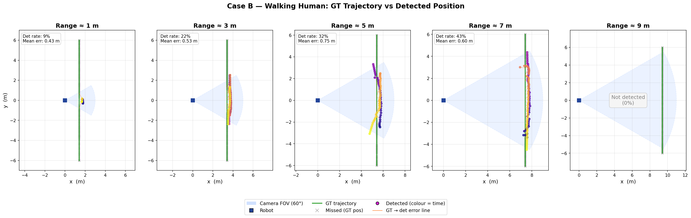
  <p><em><b>Figure P2 — Case B (walking human).</b> Per-range scatter of detected positions against the GT trajectory (green line). Grey × marks frames where YOLO produced no usable detection at the GT pose; orange line segments are individual GT → detection errors (sampled every 5th frame); the detected dots are coloured by capture time to show how the detections are distributed along the walk.</em></p>
</div>

<table>
<tr>
<td valign="top">

**Result — Case A (Standing human)**

| Range | Detection rate | Mean position error |
| :---: | :---: | :---: |
| 1 m | 39 %  | 0.32 m |
| 3 m | 100 % | 0.31 m |
| 5 m | 100 % | 0.31 m |
| 7 m | 100 % | 0.32 m |
| 9 m | 0 %   | — (not detected) |

</td>
<td valign="top">

**Result — Case B (Walking human, ~1.0 m/s lateral)**

| Range | Detection rate | Mean position error |
| :---: | :---: | :---: |
| 1 m | 9 %  | 0.43 m |
| 3 m | 22 % | 0.53 m |
| 5 m | 32 % | 0.75 m |
| 7 m | 43 % | 0.60 m |
| 9 m | 0 %  | — (not detected) |

</td>
</tr>
</table>

**Result analysis.**

*Case A — standing human.*
- **3 m to 7 m is the sweet spot.** Detection rate is 100 % and the mean position error is essentially flat at ~0.31 m. The error is **systematic, not random**: in every subplot the red cluster sits at the same offset from the green triangle, roughly along the line of sight. This is the residual of the camera-to-`base_link` calibration (the 0.40 m forward offset plus the small ground-plane assumption made in `_pixel_range_to_world`); it is *not* noise. From the planner's point of view this is harmless — the egg is anchored 0.3 m past the human along the bearing, which still puts the lethal cells well inside the human's footprint.
- **At 1 m the detection rate collapses to 39 %.** This is the failure mode we revisit in Section 8 of the discussion: at very close range the human's torso and head leave the camera's *vertical* FOV (camera is mounted at ~1.0 m above ground) and YOLO sees only the legs, which no longer match the "person" template at confidence ≥ 0.5. Note the position error is still 0.32 m — when a detection survives, it is just as accurate as the farther ranges. The problem is purely *availability*, not accuracy.
- **At 9 m there is no detection at all.** The human's bounding box becomes too small for YOLOv8n to score above the 0.5 confidence threshold, and our hard `detection_range = 8 m` cap also kicks in. This bounds the useful operating range of the social costmap to ~7 m, which is consistent with the lookahead distances actually used by the planner (`L ≤ 10 m`, but only the nearest few metres matter for the immediate egg overlay).

<table align="center">
  <tr>
    <td align="center" width="33%">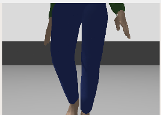</td>
    <td align="center" width="33%">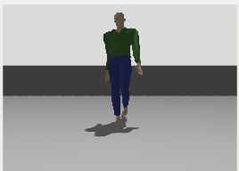</td>
    <td align="center" width="33%">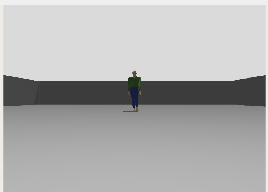</td>
  </tr>
  <tr>
    <td align="center"><b>Range ≈ 1 m</b><br>Torso and head leave the vertical FOV; only legs/feet remain in frame. YOLOv8n confidence drops below 0.5 most cycles → 39 % det rate.</td>
    <td align="center"><b>Range ≈ 5 m</b><br>Full body is in frame and well-centred. YOLO sits comfortably above the 0.5 threshold → 100 % det rate, ~0.31 m position bias.</td>
    <td align="center"><b>Range ≈ 9 m</b><br>Human's bounding-box pixel height is small and below the hard <code>detection_range = 8 m</code> cap → 0 % det rate.</td>
  </tr>
  <tr>
    <td colspan="3" align="center"><em><b>Figure P3 — Camera view at three representative ranges.</b> First-person view from the robot's front RGB camera (640 × 480, 60° HFOV, ~1.0 m mount height) illustrating <i>why</i> the Case A detection rate has the shape it does. The 1 m frame is the failure mode that bleeds into the integrated runs later in this section once the robot gets close to a pedestrian during avoidance.</em></td>
  </tr>
</table>

*Case B — walking human.*
- **Detection rate is much lower than Case A.** This is *not* a regression in the detector — it is geometry. The walking human moves laterally across a 60° FOV, so for most of each ~6 s run the person is outside the cone and necessarily undetected. The increase in det rate with range (9 % → 43 % between 1 m and 7 m) is exactly what FOV geometry predicts: a wider FOV at larger range = longer visible segment of the same lateral walk. The grey × marks in Figure P2 confirm this — the misses concentrate at the start and end of the trajectory where the human is in the FOV's blind sectors.
- **Mean position error grows with range** (0.43 m at 1 m → 0.75 m at 5 m, then 0.60 m at 7 m). Two effects compound:
  1. *Monocular depth scales as 1/h_bbox.* At larger range the bounding-box height shrinks, so any pixel-level error in the box height maps to a larger metric depth error. The LiDAR refinement corrects most of this when there is a coherent return inside the tolerance window, but the tolerance itself widens (`tol = max(1 m, 0.3·d_mono)`), so the residual is larger.
  2. *Latency compensation is imperfect.* We extrapolate the detected pose forward to `t_now` using the fitted velocity, but when the velocity fit is still warming up (early in a track) the extrapolated pose lags. This shows up as the small orange "tail" between the GT trajectory and the detection cloud in Figure P2.
- **The 5 m bump (0.75 m) is the worst case.** At this range YOLO is reliable but the monocular prior is at its widest tolerance, and at the same time the lateral angular velocity of the human is still large enough that any latency in the YOLO + tracker pipeline produces a visible position lag. By 7 m the angular velocity has dropped (same linear speed, more range), and the error drops back to 0.60 m.

*Implications for the integrated system.*
- The perception module **is reliable inside ~7 m, in the front cone, when the human is mostly stationary** — exactly the corridor-style geometry of the reference CPTEB paper.
- It is **not reliable when the robot is close to the human and turning away from them** (1 m + lateral motion + sideways heading change). This is precisely the situation the planner *creates* during an avoidance manoeuvre: the robot moves toward the human, then yaws away. This compound failure is the root cause of the residual collisions in Worlds C/D (see Section 8), and the perception numbers above quantitatively explain why a tuner can shift the symptom around (with lookahead, with σ<sub>min</sub>) but cannot eliminate it without changing the sensor geometry.


### Planner & System Integration

| World | Look ahead | Path distance (m) | Reach Goal |
| :--- | :---: | :---: | :---: |
| **2 Static Obstacles (B)** | 2 | 9.9 | No |
| | 5 | 16.9 | Yes |
| | 10 | 16.8 | Yes |
| | 15 | 17 | Yes |
| **2 Static Obstacles (B) no_preroute** | 5 | 10.2 | No |
| **2 human with opposite directions (C)** | 2 | 15.1 | Yes |
| | 5 | 17 | Yes |
| | 10 | 18.2 | Yes |
| **2 human with same directions (D)** | 2 | 15.7 | Yes |
| | 5 | 16.5 | Yes |
| | 10 | 16.6 | Yes |


#### **Static Obstacle (Planner Only)**
  - Pre-routing is necessary for the band to escape the two blocking polygons. Without it, the band stays trapped and the robot **does not reach the goal** (see the `no_preroute` row in the table). With pre-routing, the band consistently detours around the closer side.
  - At the smallest lookahead (`L = 2 m`) the planner can also not pass the obstacle — the lookahead window is too short to even contain both blocks, so the band has no room to deform around them. From `L = 5 m` upward, the goal is reliably reached.
  - As the lookahead distance grows, the **path length increases monotonically** (16.9 → 16.8 → 17 m for L = 5 / 10 / 15). With a longer horizon the planner commits earlier to a wider detour around the polygons, which produces a smoother but slightly longer trajectory.

<table>
  <tr>
    <td>
      <a href="https://drive.google.com/file/d/1NyaIWAZPBZ8cbCzn6NQnd6zMmqE3zcPJ/view?usp=sharing"><b>Click to watch video (Google Drive)</b></a>
      <p align="center">World 2 — Static slalom, lookahead L = 2 m. Band horizon is too short; robot fails to detour past the first block.</p>
    </td>
    <td>
      <a href="https://drive.google.com/file/d/1GCdzEr03NmC8f1AE_QTnNH3LGLjRo2bO/view?usp=sharing"><b>Click to watch video (Google Drive)</b></a>
      <p align="center">World 2 — Static slalom, L = 5 m. Pre-routing + EB find a clean S-shape detour; goal reached at 16.9 m.</p>
    </td>
        <td>
      <a href="https://drive.google.com/file/d/1z7C-3d4KFpdrm0dC9a7KBvpKxGN0m4la/view?usp=sharing"><b>Click to watch video (Google Drive)</b></a>
      <p align="center">World 2 — Static slalom, L = 10 m. Longer horizon commits to the detour earlier; goal reached at 16.8 m.</p>
    </td>
  </tr>
</table>

<table>
  <tr>
    <td>
      <a href="https://drive.google.com/file/d/1rYP9rh2NTMDw5bVTDuyXh__RWarmxI4A/view?usp=sharing"><b>Click to watch video (Google Drive)</b></a>
      <p align="center">World 2 — Static slalom, L = 15 m. Maximum tested lookahead; widest detour, goal reached at 17 m.</p>
    </td>
    <td>
      <a href="https://drive.google.com/file/d/13aRgzbX17HON6l24CXhpB5pq2ICFHT_-/view?usp=sharing"><b>Click to watch video (Google Drive)</b></a>
      <p align="center">World 2 — Static slalom, L = 5 m, <b>pre-routing disabled</b>. Band stays pinned between the two polygons; robot fails to reach the goal (stops at ~10 m, see no_preroute row).</p>
    </td>
  </tr>
</table>

<table>
  <tr>
    <td align="center">
      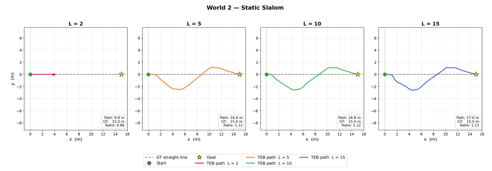
      <p><b>Figure W2.</b> World 2 (Static Slalom) — overhead view of the recorded robot trajectories for lookaheads L = 2, 5, 10, 15 m. The dashed grey line is the 15 m straight-line goal; coloured lines are the executed paths. At L = 2 the robot halts at ~4 m (no detour found); from L = 5 onwards the band consistently produces an S-shape detour with path ratio ~1.12–1.13.</p>
    </td>
  </tr>
  
  <tr>
    <td align="center">
      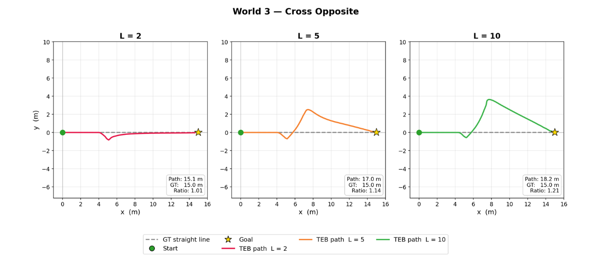
      <p><b>Figure W3.</b> World 3 (Cross Opposite, planner only) — recorded robot trajectories for L = 2, 5, 10 m. Larger lookaheads commit to a wider swerve (peak lateral offset grows from ~0.5 m at L = 2 to ~3.7 m at L = 10) and produce longer overall paths (15.1 → 17.0 → 18.2 m), because the band reacts to the second human earlier on the long-horizon plan.</p>
    </td>
  </tr>
  
  <tr>
    <td align="center">
      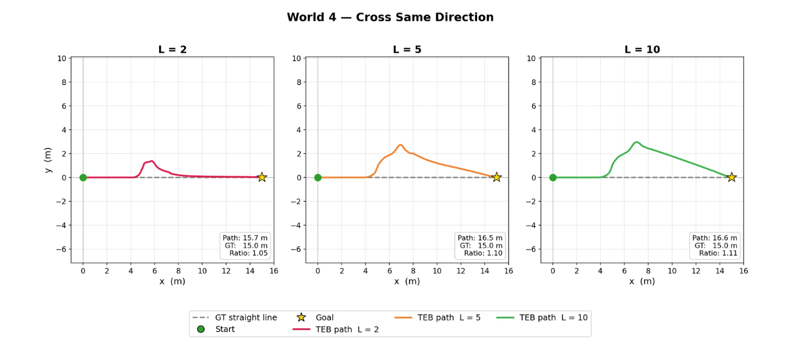
      <p><b>Figure W4.</b> World 4 (Cross Same Direction, planner only) — recorded robot trajectories for L = 2, 5, 10 m. All three lookaheads reach the goal; the path ratio stays close to 1.05–1.11 because both humans share the same heading, so a single sideways detour clears both at once.</p>
    </td>
  </tr>
</table>


#### **Dynamic Obstacle (Planner Only)**
  - In the dynamic-obstacle worlds the robot reaches the goal at **every tested lookahead**, but it does **not avoid the collision with the first human** — the LiDAR only sees the human as a point cloud at the moment of contact, so the planner has no early warning and the band only deforms once the human is already within the inflation radius.
  - Path length **grows monotonically with lookahead** for the same reason as in the static case: with a longer horizon the planner reacts to the upcoming human earlier and commits to a wider, smoother detour (15.1 → 17.0 → 18.2 m for L = 2 / 5 / 10 in World C).
  - After clearing the first human, the band can **shift to the opposite homotopy class**. Once human #1 is behind the robot, its contraction (smoothness) force pulls subsequent nodes back across the corridor faster than the residual repulsion from #1 pushes them away, so the band snaps from one side of the corridor to the other.

##### World C — Cross Opposite, planner only
<table>
  <tr>
    <td>
      <a href="https://drive.google.com/file/d/1QjaiG-9RzIO2hFpwkWY2X_ez6vtYnq6O/view?usp=sharing"><b>Click to watch video (Google Drive)</b></a>
      <p align="center">World C — Cross Opposite, L = 2 m. Minimal detour; robot brushes past both humans (path 15.1 m, ratio 1.01).</p>
    </td>
    <td>
      <a href="https://drive.google.com/file/d/1mmTdNenxGuiAxO5Vku4yMWOuI7gat2R9/view?usp=sharing"><b>Click to watch video (Google Drive)</b></a>
      <p align="center">World C — Cross Opposite, L = 5 m. Visible swerve to +y; band briefly settles in the upper homotopy class (path 17 m).</p>
    </td>
        <td>
      <a href="https://drive.google.com/file/d/1FFDu5uqZ0YiOLL6KUaV26rEyTPkU5Lpd/view?usp=sharing"><b>Click to watch video (Google Drive)</b></a>
      <p align="center">World C — Cross Opposite, L = 10 m. Largest swerve (~3.7 m lateral); long horizon plans the detour earlier (path 18.2 m).</p>
    </td>
  </tr>
</table>

##### World D — Cross Same Direction, planner only
<table>
  <tr>
    <td>
      <a href="https://drive.google.com/file/d/1SQt6mtIlxNyi0AtqE0jXAke63yKXWVw0/view?usp=sharing"><b>Click to watch video (Google Drive)</b></a>
      <p align="center">World D — Cross Same Direction, L = 2 m. Single small detour clears both humans (path 15.7 m, ratio 1.05).</p>
    </td>
    <td>
      <a href="https://drive.google.com/file/d/1ZF99rU6tB3iZpac76aE6EJu713WjTd7V/view?usp=sharing"><b>Click to watch video (Google Drive)</b></a>
      <p align="center">World D — Cross Same Direction, L = 5 m. Wider swerve to the same side; path 16.5 m.</p>
    </td>
        <td>
      <a href="https://drive.google.com/file/d/169_ShgPkH95CiV10UP4ufTVr4t6Plwnb/view?usp=sharing"><b>Click to watch video (Google Drive)</b></a>
      <p align="center">World D — Cross Same Direction, L = 10 m. Earliest commitment to detour; path 16.6 m.</p>
    </td>
  </tr>
</table>

#### **Dynamic Obstacle (Integrated System)**

This is the full pipeline: the GMM perception module from Section 4 is now driving the EB planner from Section 3 through the shared `/local_costmap_social` topic. The planner-only runs above used only the LiDAR layer (`cost_map_topic: /local_costmap`); the integrated runs flip the parameter to `/local_costmap_social`, which is the same grid with the egg-shaped Gaussians fused in. Nothing else in the planner changes.

##### Mixed scenario — static obstacles + two cross-opposite pedestrians

Before we run the dynamic-only worlds (C and D), the integrated system is sanity-checked on a *mixed* scenario that combines **both** obstacle types from Section 6 in a single map: **3 static blocks** (the geometry of scenario B) **and 2 pedestrians walking in opposite directions** (the motion pattern of scenario C). This is the only scenario in this section that simultaneously stresses (a) the MCCH polygon extraction (the static blocks are unseen by perception and have to be discovered through the LiDAR costmap) and (b) the GMM social channel (both pedestrians have to be detected, tracked, and projected ahead). All other parameters — start, goal, lookahead `L = 5 m`, costmap topic, robot/human velocities — match the Section 6 setup.

<div align="center">
  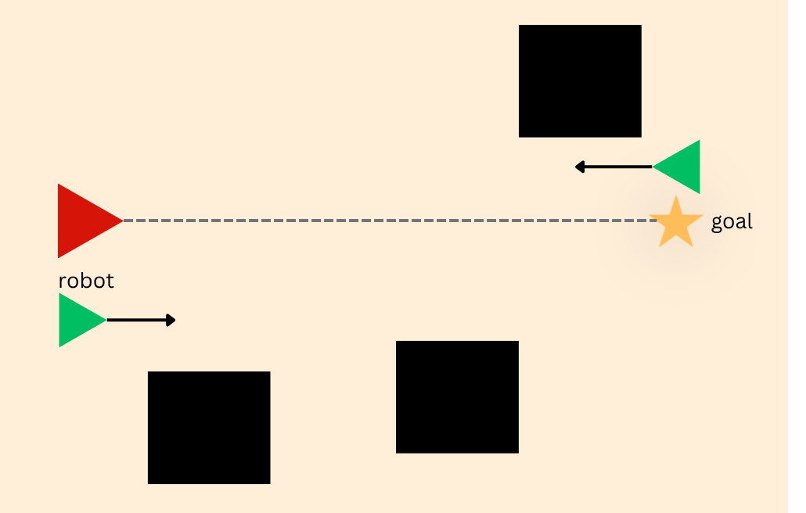
  <p><em><b>Figure I-M — Mixed scenario map.</b> <b>Red triangle (left):</b> robot at its start pose, facing +x along the dashed grey straight-line global path toward the goal. <b>Yellow star (right):</b> goal pose. <b>Two green triangles with arrows:</b> the two pedestrians and their walking directions — one moving in the same direction as the robot (lower-left, +x) and one moving head-on toward the robot (upper-right, −x), i.e. the cross-opposite motion pattern of scenario C. <b>Three black squares:</b> the static obstacles from scenario B. The integrated stack must therefore handle MCCH-extracted block polygons and GMM-painted pedestrian eggs in the same costmap.</em></p>
</div>

<table>
  <tr>
    <td>
      <p align="center"><a href="https://drive.google.com/file/d/1f4fUJvA3Oy3uN8YUw3PRORjGWu5zWfOG/view?usp=sharing"><b>Click to watch video (Google Drive)</b></a></p>
      <p align="center">Mixed scenario (Figure I-M) — integrated GMM + EB at L = 5 m. The band deforms around the static blocks (MCCH) while the egg-shaped social cost of the oncoming pedestrian pushes the robot off the straight-line homotopy class early.</p>
    </td>
  </tr>
</table>

**What we run.**
Two scenarios from Section 6, both at the same lookahead so the only varying factor between this and the planner-only result is whether the social costmap is on:

| Item | World C (Cross Opposite) | World D (Cross Same Direction) |
|---|---|---|
| Robot start → goal | (−7, 0) → (+8, 0), straight-line distance = 15 m | (−7, 0) → (+8, 0), straight-line distance = 15 m |
| Robot heading | left → right (along +x) | left → right (along +x) |
| Human 1 | starts at (+2, −8), walks +y | starts at (+1, −8), walks +y |
| Human 2 | starts at (−2, +8), walks −y (toward human 1) | starts at (−1, −8), walks +y (parallel to human 1) |
| Lookahead `L` | 5 m | 5 m |
| Social layer | **on** (`/local_costmap_social`) vs off (baseline) | **on** vs off |

**Velocities — the interaction-time setup.**
The relative velocity between the robot and each human sets how long the planner has to both see the human and deform the band before the human is past. The robot's velocity profile is whatever the [robot motion controller](#robot-motion-controller) from Section 6 produces — i.e. cruise at `v_max` along the band direction, P-servo on yaw toward the goal, and a linear 1 : 1 deceleration only inside the final 1.5 m to the goal:

| Quantity | Value | Source |
|---|---|---|
| Robot `v_max` (linear) | 1.5 m/s | `path_planning_node` (`self.v_max = 1.5`) |
| Robot `ω_max` (yaw rate) | 1.2 rad/s | `path_planning_node` (`self.w_max = 1.2`) |
| Yaw P-gain | `yaw_kp = 1.5`, reference = `atan2(g_y−r_y, g_x−r_x)` | continuously points body at goal |
| Slow-down rule | only `d_goal < 1.5 m`: `v_target = d_goal` (1 : 1 ramp, floor 0.05 m/s) | `_compute_cmd_vel` step 3 |
| Robot achieved cruise speed | **1.5 m/s** for ~95 % of each 15 m run; ramps from 1.5 → 0.05 m/s in the final 1.5 m | derived from controller |
| Obstacle-proximity slow-down | **none** — no v(d_obs) term in the controller | by design |
| Human walking speed | **1.2 m/s** | World SDF: 2.4 m / 2 s waypoint spacing |
| Relative speed — World C (head-on along y) | **~2.7 m/s** (robot 1.5 m/s along x, human 1.2 m/s along ±y, full magnitude of (vᵣ − vₕ)) | derived |
| Relative speed — World D (parallel humans) | **~1.92 m/s** (robot 1.5 along x, both humans 1.2 along +y; the planner only needs to dodge one ridge) | derived |
| Interaction time per human (in robot's FOV at `L=5`) | ~3–5 s | observed from `perception_log_*.csv` |
| Stopping budget at cruise | **1.3 s** to traverse the 1.92 m forward lobe of the egg at v_max — no in-stack brake on obstacle proximity | derived |

**Egg (social) parameters in use.**
Same values as the perception sweep in Section 6, repeated here so the integrated run is reproducible from this section alone:

```
sigma_front = 1.2 + 0.6 * |v|   # m, grows with speed
sigma_back  = 0.4               # m
sigma_side  = 0.5               # m
peak_cost   = 85                # 0–100 occupancy units
detection_range = 8.0           # m hard cap
```

At a 1.2 m/s human, `σ_front = 1.2 + 0.6·1.2 = 1.92 m` — i.e. the lethal forward lobe of each egg is ~2 m long. That length, plus the rounded sides, is what makes the difference visible in the path-length numbers below.

##### Result recordings

The two L = 5 m integrated runs were recorded in-simulator; the path-length and clearance numbers come from the CSV logs and are reported together in the *Result numbers* table and *Figure GMM* below.

<table>
  <tr>
    <td align="center" width="50%">
      <a href="https://drive.google.com/file/d/1LFt5x1_SnzOqKb-5BmGkbr29_Vwer_SZ/view?usp=sharing"><b>Click to watch the World C run (Google Drive)</b></a>
      <p><em><b>World C — Cross Opposite, L = 5 m.</b> Integrated GMM + EB. Egg-shaped social zones are rendered around each detected human in real time as the robot reacts to H1.</em></p>
    </td>
    <td align="center" width="50%">
      <a href="https://drive.google.com/file/d/1JOxNYZfcf0W5iiaS-DpbTLDISs_LGdpy/view?usp=sharing"><b>Click to watch the World D run (Google Drive)</b></a>
      <p><em><b>World D — Cross Same Direction, L = 5 m.</b> Integrated GMM + EB. Both humans share the same heading; the two forward lobes merge into a single cost ridge that the band rounds in one sideways step.</em></p>
    </td>
  </tr>
</table>

##### Result numbers

All values measured directly from the CSV logs (robot path from `path_planning_node`, human GT from the SDF waypoints at the matching sim time). "Min robot-human distance" is the minimum of `‖robot(t) − human_i(t)‖` over both humans across the whole run. Because that distance is **centre-to-centre** and both the mecanum base and the simulated pedestrian occupy roughly a 0.5 m radius around their respective centres, a centre-to-centre distance below ~1.0 m corresponds to a body-to-body **graze** in the recording, and below ~0.5 m to a full **collision**.

| World | Layer | Path length | Δ vs baseline | Min robot-human dist (centre-to-centre) | Outcome (body-to-body) |
| :--- | :--- | :---: | :---: | :---: | :---: |
| **World C — Cross Opposite (L = 5 m)** | LiDAR only (baseline) | 17.05 m | — | **1.08 m** | Clears both humans |
|                              | LiDAR + GMM (integrated) | **15.99 m** | **−1.06 m** | **0.46 m** | ⚠ Collides with H1 |
| **World D — Cross Same Direction (L = 5 m)** | LiDAR only (baseline) | 16.50 m | — | **1.54 m** | Clears both humans |
|                              | LiDAR + GMM (integrated) | **15.33 m** | **−1.17 m** | **1.07 m** | ⚠ Grazes H1 |

<div align="center">
  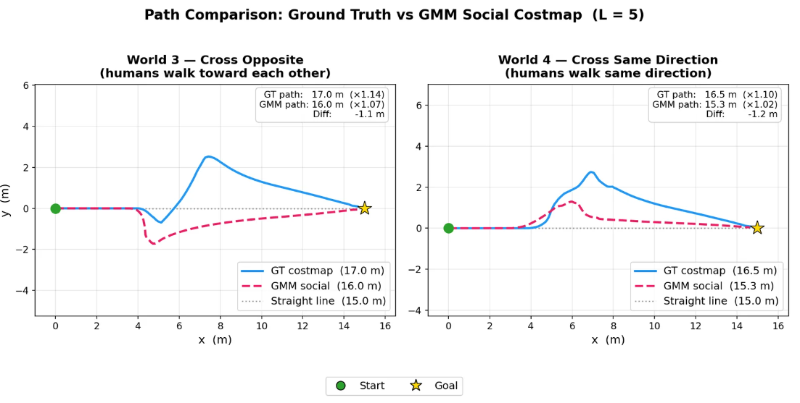
  <p><em><b>Figure GMM.</b> The original head-to-head path comparison from our earlier analysis (planner-only blue vs GMM-integrated dashed pink). Numbers agree with the log-based reconstruction above to within rounding.</em></p>
</div>

##### Result analysis

**Headline finding — both World C and World D fail in the integrated runs.** Even though the egg shortens the path in both (−1.06 m in C, −1.17 m in D), neither integrated run actually avoids the first human. World C is a clear collision (centre-to-centre 0.46 m → body-to-body contact); World D is a graze (centre-to-centre 1.07 m → body-to-body ~0.07 m clearance). The two outcomes look different on a min-distance metric but the **mechanism is the same**: the GMM channel cannot maintain a detection on a human that is close to the robot, so during the critical final ~1 s of the encounter the local planner has *no* social cost to deform the band against — and the band relaxes back into the human's path. In short, **the robot collides because it cannot see the human.**

**Why the GMM channel goes dark at close range.** Three perception/geometry factors compound at exactly the wrong moment (the same three causes summarised in Section 8 Discussion, but they are the direct cause of the result here so they belong in this analysis too):

1. **Robot height — low camera loses the human.** The front camera is mounted at ~1.0 m above the ground. At 1–2 m range the human's torso and face leave the camera's *vertical* FOV and only the legs remain in frame, so YOLO drops the detection (the bounding box no longer matches the "person" template). The Perception sweep in Section 7 quantifies this directly: **detection rate falls to 39 % at 1 m range** (Figure P3, leftmost panel, repeated as Figure I-Cam below). The reference CPTEB paper uses a taller service-robot platform (~1.4–1.6 m camera) that keeps the torso visible at close range.
2. **Limited FOV — the human exits the view.** The 60° horizontal cone only sees humans within ±30° of the robot's heading. During avoidance the controller's goal-pointing yaw P-servo (see [Robot motion controller](#robot-motion-controller)) keeps rotating the chassis back toward the goal, so the human slides out of the FOV side just as the robot is trying to pass them. Obstacle information is lost precisely when the planner needs it most.
3. **Situation mismatch — open space vs. corridor.** The reference paper operates in narrow hotel corridors (~2 m wide), where the walls constrain both robot and human to stay within each other's FOV even during sideways motion. Our wide open environments let the elastic band swing the robot several metres laterally; the human exits the FOV completely, the social costmap disappears, and the planner overcorrects or collides. Narrow space, counter-intuitively, is an *advantage* for this perception setup.

> **Root cause.** The three factors compound at the same instant — robot close to the human, turning away from it, in open space — creating a *detection blackout* exactly when the social costmap is needed most. This is identically the failure mode in both World C and World D.

<table align="center">
  <tr>
    <td align="center" width="55%">
      
    </td>
    <td valign="middle" width="45%">
      <em><b>Figure I-Cam — what the robot's camera sees at 1 m range.</b> Same screenshot as the leftmost panel of Figure P3 in Section 7, repeated here because it is the direct cause of both Worlds C and D failing. When the avoidance manoeuvre brings the robot inside ~1.5 m of a pedestrian, this is the input YOLO has to score: head and torso are above the vertical FOV, only legs and feet are in frame. Detection rate in this regime is <b>39 %</b> — the social costmap blanks out, and the local planner has no obstacle to deform the band against during the critical final ~1 s of the encounter.</em>
    </td>
  </tr>
</table>

**Why World C is the worse of the two — relative velocity.** Both worlds suffer the same blackout, but the consequence differs by how quickly the human and robot pass through each other. In World C the closing rate is ≈ 2.7 m/s (head-on along the lateral axis), so H1 transits the robot's path in ≈ 1.5 s — shorter than the perception pipeline's worst-case dropout (~0.3 s detection latency + 0.8 s tracker coast ≈ 1.1 s) — and the robot is still on H1's lane when contact happens (0.46 m centre-to-centre). In World D the parallel humans give a relative speed of ≈ 1.92 m/s and an interaction window roughly twice as long, so the band sometimes recovers a few decimetres of clearance before contact — but only barely (1.07 m centre-to-centre = ~0.07 m body-to-body). A small timing shift in either run would flip both outcomes.

**Cross-link to Section 6 controller.** The planner emits the band-tangent at `v_max = 1.5 m/s` cruise with **no obstacle-proximity slow-down** (only a 1 : 1 ramp inside the final 1.5 m to goal — see the [Robot motion controller](#robot-motion-controller) table). At 1.5 m/s, the World C 0.46 m clearance corresponds to ≈ 0.3 s of separation — even if YOLO did produce a detection at that instant, the controller would not have the kinematic margin to brake. The stack is missing **both** a perception layer that survives close range *and* a velocity layer that scales with proximity.

**Take-away.** The integrated system shortens both paths (the directional Gaussian works whenever the human is *in view*), but the absence of GMM detections during the close-range pass means the local planner is blind in exactly the moment it has to act — and the robot collides with the human in both worlds. Closing the gap requires (a) a controller layer that decelerates when an egg comes within stopping distance, and (b) a perception geometry (taller camera, wider FOV, or corridor-style environment) that keeps the human in view through the avoidance manoeuvre. Both are discussed in Section 8.

##### Oracle ablation — Toy_Exp1 (GT-driven egg in the same scene)

The result above attributes the W3 collision and W4 graze to a **perception failure** rather than a planner failure. To prove that, we run a fourth experiment — labelled **Toy_Exp1** — on the **same mixed-scenario map as the Integration section** (3 static obstacles + 2 cross-opposite pedestrians, identical robot start/goal, identical SDF walking speeds), but **the egg is painted from `/human_gt_poses` ground-truth instead of from the YOLO + LiDAR + tracker pipeline**. This is an oracle baseline: it shows what the EB planner does when the only thing that has changed between two runs is whether perception is perfect.

Setup — everything matches the integrated runs above except the egg's source:

| Item | Integrated runs (W3 / W4) | Toy_Exp1 (this ablation) |
|---|---|---|
| Map | Mixed (3 blocks + 2 peds) | **Same map** |
| Robot start / goal | (−7, 0) → (+8, 0) | Same |
| Pedestrian speed / waypoints | 1.2 m/s, SDF-scripted | Same |
| EB planner / costmap fusion / controller | unchanged | unchanged |
| **Egg source** | YOLO + LiDAR depth + per-person tracker | **`/human_gt_poses` ground truth** |
| Lookahead `L` sweep | 5 m only | **{2, 5, 10, 15} m** |

<table>
  <tr>
    <td>
      <a href="https://drive.google.com/file/d/1Xg5Mb6aMDrjUaOOGSw_ySJ2KpGwY9u3R/view?usp=sharing"><b>Click to watch video (Google Drive)</b></a>
      <p align="center">Toy_Exp1 — GT-driven egg, L = 2 m. Short horizon keeps the path tight; the band only deforms once the GT egg enters the local window.</p>
    </td>
    <td>
      <a href="https://drive.google.com/file/d/1K9MzvVvSuXbOD35_XX9zHtmRRbu9N_M7/view?usp=sharing"><b>Click to watch video (Google Drive)</b></a>
      <p align="center">Toy_Exp1 — GT-driven egg, L = 5 m. Smooth single-side detour around each pedestrian, driven by the asymmetric Gaussian fed from ground truth.</p>
    </td>
  </tr>
  <tr>
    <td>
      <a href="https://drive.google.com/file/d/1GnU2fVIn3FeB0FwVNary1NTUOUQ0LS8g/view?usp=sharing"><b>Click to watch video (Google Drive)</b></a>
      <p align="center">Toy_Exp1 — GT-driven egg, L = 10 m. Longer horizon starts the detour earlier and overshoots laterally; the path is still safe but visibly less efficient.</p>
    </td>
    <td>
      <a href="https://drive.google.com/file/d/1Tbc9RQhXN3df6wsRW9gXKI_TvYGsWAwb/view?usp=sharing"><b>Click to watch video (Google Drive)</b></a>
      <p align="center">Toy_Exp1 — GT-driven egg, L = 15 m. Widest lookahead tested; the band commits to the avoidance manoeuvre at maximum range, producing the largest lateral overshoot.</p>
    </td>
  </tr>
</table>

**What this proves.** In **every** Toy_Exp1 run the robot clears both pedestrians and reaches the goal. The map, the EB planner, the costmap fusion, the controller and the pedestrian motions are identical to the integrated W3 / W4 runs that collided. The *only* change is the egg's source — YOLO-driven vs GT-driven — and that single change is enough to recover safe avoidance. This is a direct ablation: **the bottleneck is in the perception stack at close range, not in the EB planner or the controller**. It also confirms the secondary lookahead-sensitivity finding from the planner-only sweeps: the smallest L keeps the path tightest, while L = 15 m produces the largest lateral overshoot — the band's reach into the horizon decides how early the detour commits, even when perception is perfect.


##  8. Discussion
Our framework reliably avoids **static unseen obstacles**, but it does **not** consistently avoid collisions with dynamic obstacles (pedestrians). The failure is not in the planner — when the social costmap is present, the band correctly deforms around it. The failure is in **keeping the social costmap alive at the moment of avoidance**. Three perception/setup factors compound at exactly the wrong time:

**1) Robot height — low camera loses the human.**
Our camera is mounted at ~1.0 m above the ground. At a 1–2 m range, the human's torso and face leave the camera's vertical field of view and only the legs remain in frame — at which point YOLO drops the detection (the bounding box no longer matches the "person" template). The social costmap then vanishes, the planner thinks the path is clear, and the robot drives into the human. This is exactly the regime captured by the leftmost panel of [Figure P3 in Section 7](#perception-1): at 1 m the camera sees legs only, det rate falls to 39 %, and the integrated runs in Worlds C/D inherit the same failure the moment the avoidance manoeuvre brings the robot inside ~1.5 m of a pedestrian. By contrast, the reference paper uses a taller service-robot platform (camera at ~1.4–1.6 m) that still sees the torso/face at close range.

**2) Limited FOV — the human exits the view.**
The camera has a 60° horizontal cone, so a human is only visible within ±30° of the robot's heading. During an avoidance manoeuvre the robot turns away from the human (or the human moves sideways into the corridor), and the person leaves the FOV. The obstacle information is lost precisely when the planner needs it the most.

**3) Situation mismatch — open space vs. hotel hallway.**
The reference paper operates in narrow hotel corridors (~2 m wide). In that geometry, even when the robot moves sideways the hallway walls keep the human within the camera FOV, so detection is maintained and avoidance is smooth. Our simulation uses wide, open environments — the elastic band can swing the robot several metres to the side, the human exits the FOV entirely, the social costmap disappears, and the planner either overcorrects or collides. Counter-intuitively, **narrow space is an advantage** for this perception setup: the geometry constrains both the robot and the human to stay visible to each other.

> **Root cause.** All three issues compound at the same instant — the robot is close to the human, turning away from it, and in open space — creating a *detection blackout* exactly when the planner needs the social costmap most.

**4) Experiment setup — relative velocity matters.**
The relative velocity between the robot and the human directly sets the **interaction time** — the window in which the planner can both see the human and deform the band. If the robot is too slow, it cannot pass in front of the oncoming human and the band gets stuck against the moving Gaussian. If the robot is too fast, the band reacts only briefly to the human before the human is already behind it, so the avoidance is essentially ignored. Tuning the robot/human speed pair to a sensible interaction time is therefore a prerequisite for a fair evaluation of the social planner.

